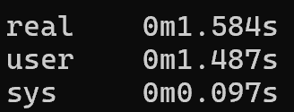
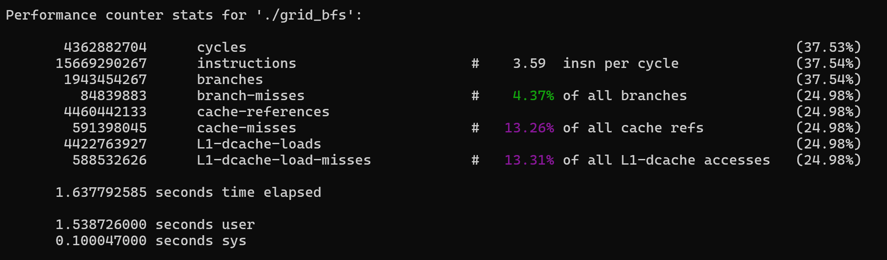
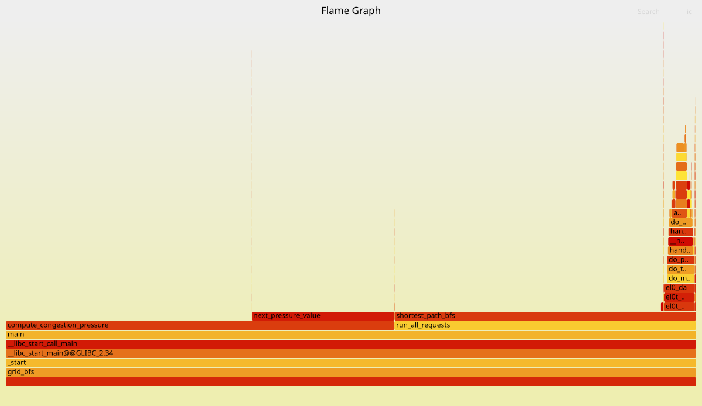
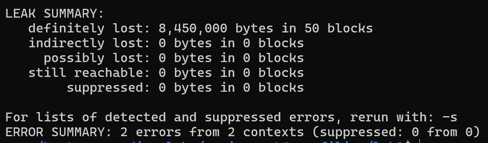
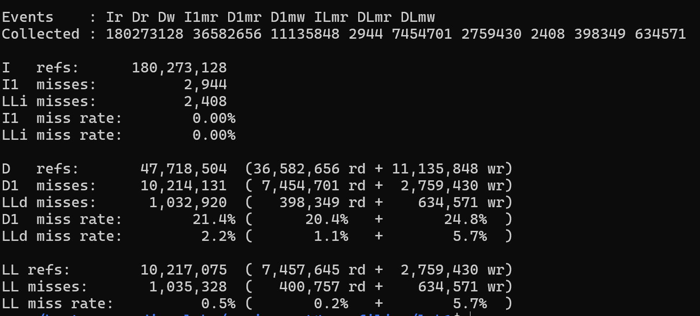
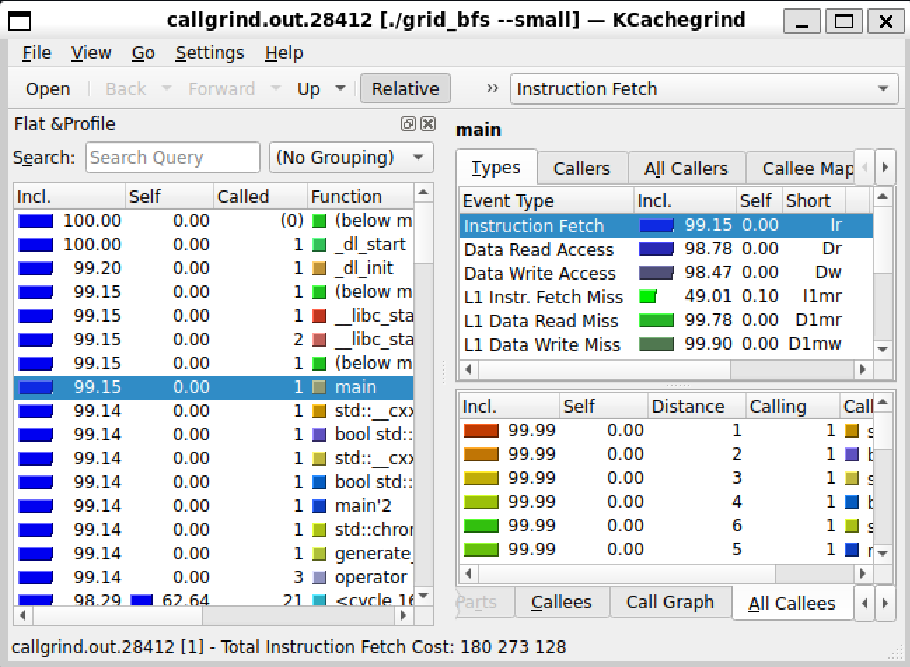

# Intro Profiling Lab Report

## 1. Optimizations Made

1. Remove memory leaks - delete the distance and visited arrays in shortes_bfs_path before returning.
2. Remove noinline attributes and make to_index, in_bounds, is_open inline.
3. Process in row-major order in compute_congestion_pressure to take advantage of cache-locality.
4. Inline next_pressure_value.
5. Hoist distance, visited and frontier arrays in shortest_path_bfs to top - prevents repeatedly allocating and deallocating memory on heap for the three arrays in each call.
6. Replace fill of visited with counter - Instead of 1 representing visited, maintain a counter variable for the current bfs call number and check visited based on that. Removes the need to fill the visited array (vis) on each call.

## 2. Methodology Walkthrough

Include before/after evidence from:

- `time`
- `perf stat`
- FlameGraph
- Callgrind/KCachegrind
- Valgrind leak summary

Before:

## 3. Correctness Evidence

Include:

- `make test`
- Final normal run output
- Checksum comparison before and after optimization

## 4. Conceptual Questions

Answer Q1.1 through Q6.1 from the README.
