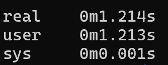
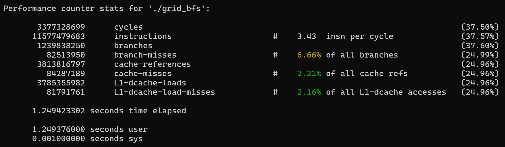
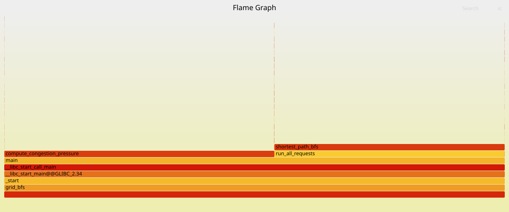
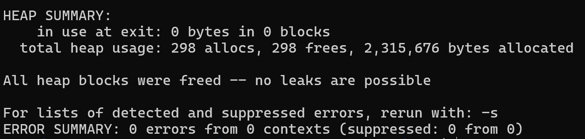
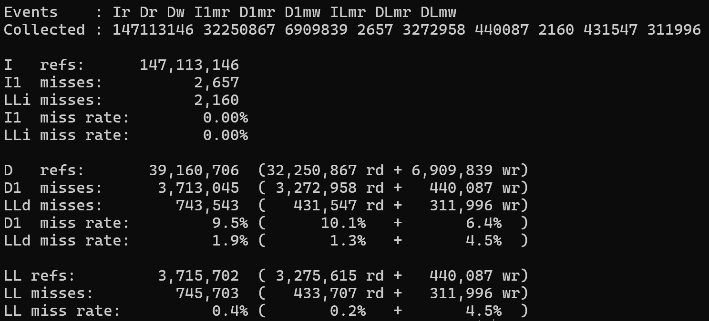
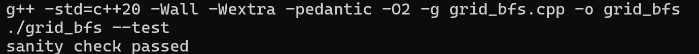
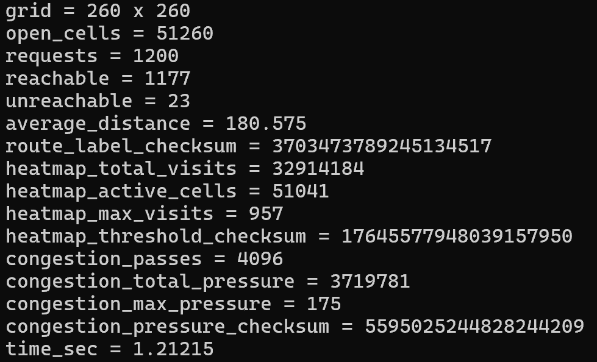
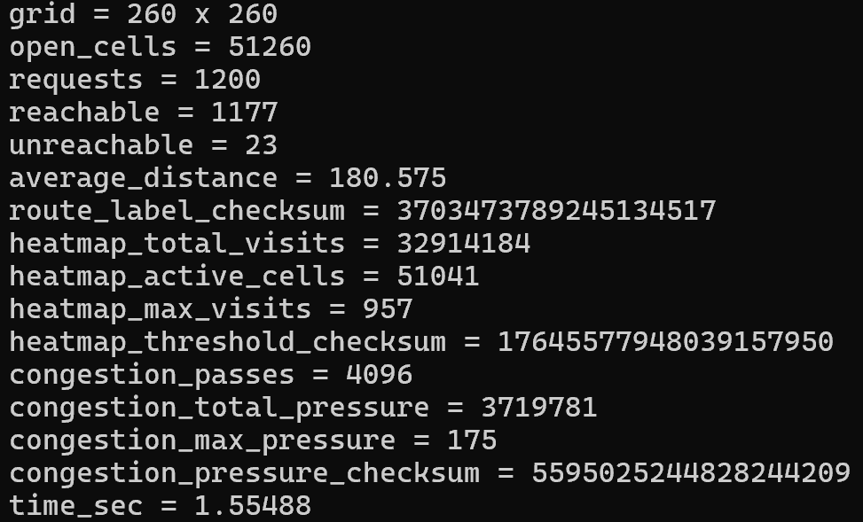

# Intro Profiling Lab Report

## 1. Optimizations Made

1. Remove memory leaks - delete the distance and visited arrays in shortest_bfs_path before returning.
2. Remove noinline attributes and make to_index, in_bounds, is_open inline.
3. Process in row-major order in compute_congestion_pressure to take advantage of cache-locality.
4. Inline next_pressure_value.
5. Hoist distance, visited and frontier arrays in shortest_path_bfs to top - prevents repeatedly allocating and deallocating memory on heap for the three arrays in each call.
6. Replace fill of visited with counter - Instead of 1 representing visited, maintain a counter variable for the current bfs call number and check visited based on that. Removes the need to fill the visited array (vis) on each call.
7. Use suffix sums to make threshold loop in summarize_heatmap O(n) instead of O(n^2).
8. Make transition arrays in shortest_path_bfs (drow and dcol) static so that they're only constructed once.
9. Remove branching in run_all_requests.

## 2. Methodology Walkthrough

I mainly used perf and time. I tried to optimize the hot-paths, which turned out to be compute_congestions_pressure and shortest_path_bfs. After each change I timed it's performance (using time and the in-program chrono clock) to compare to the previous version.

### Before:

time:

perf stat:

flamegraph:

valgrind:

callgrind:

### After:

time:

perf stat:

flamegraph:

valgrind:

callgrind:

## 3. Correctness Evidence

make test:

Output after optimization:

Output before optimization:

Checksums are same.

## 4. Conceptual Questions

Answer Q1.1 through Q6.1 from the README.
