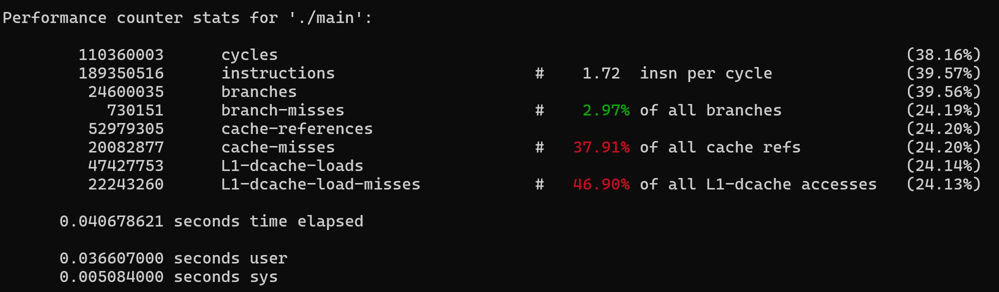
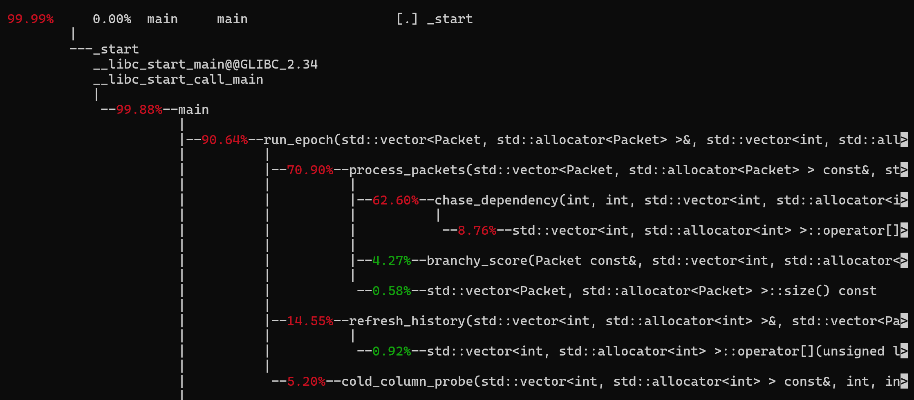
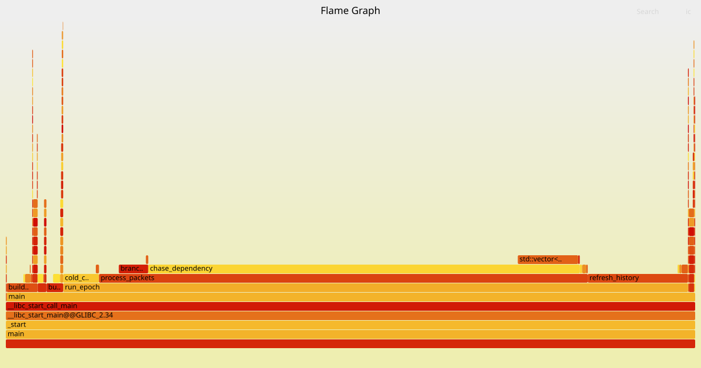
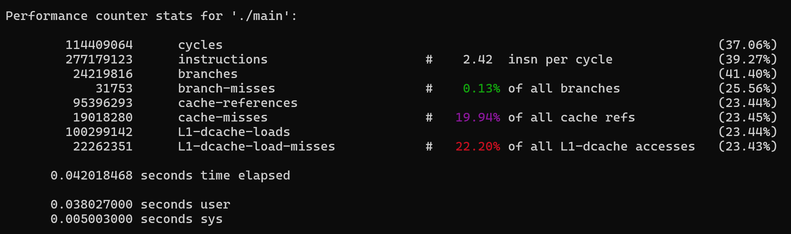
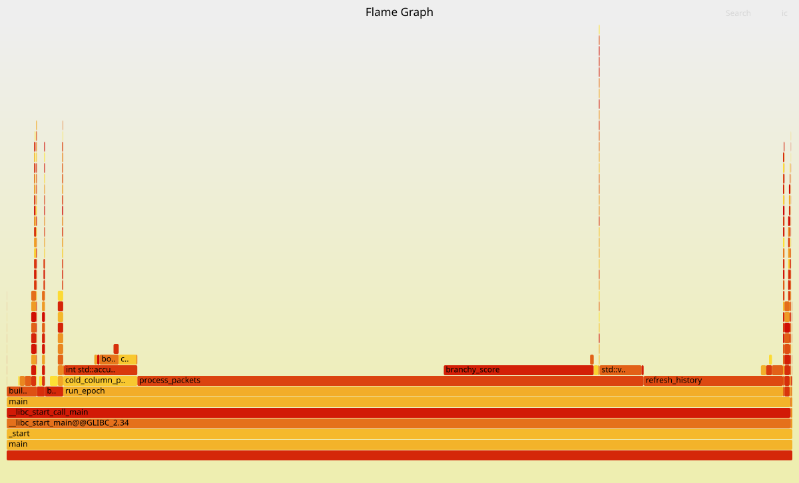
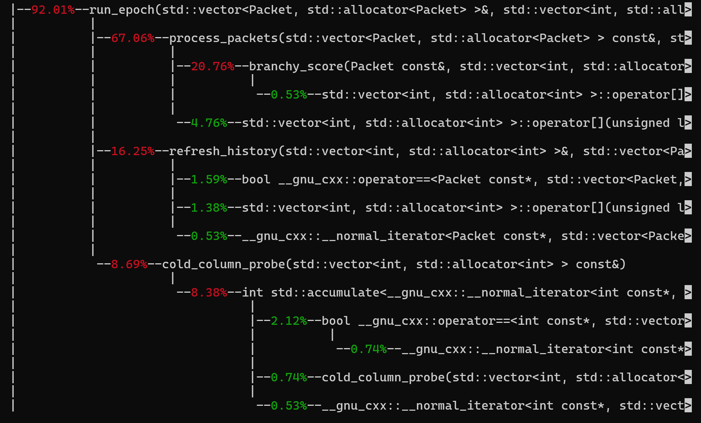
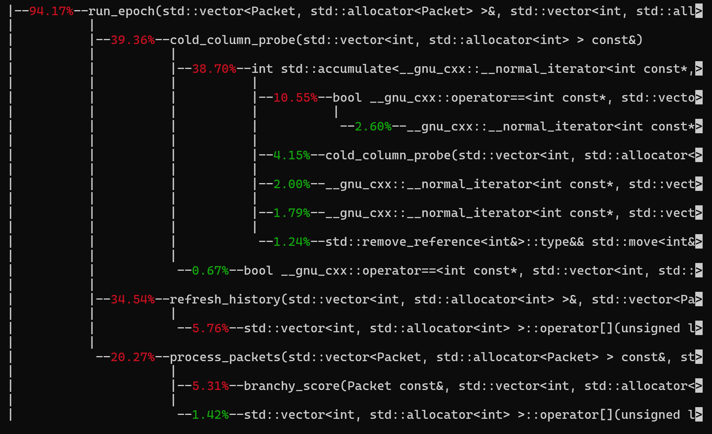
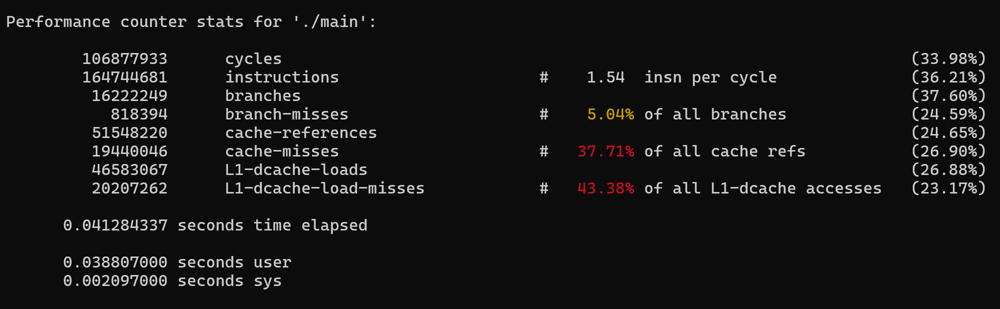
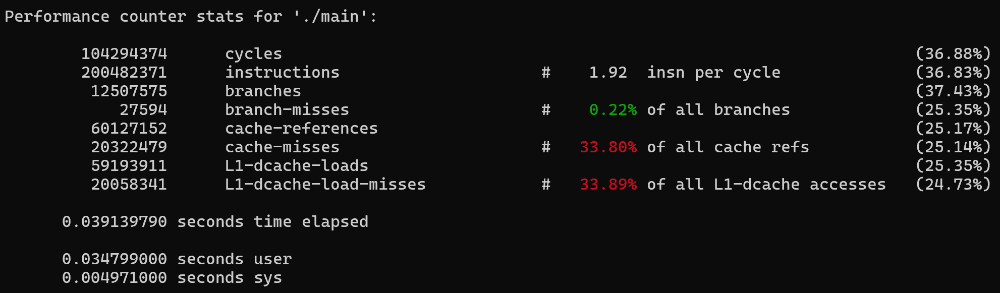
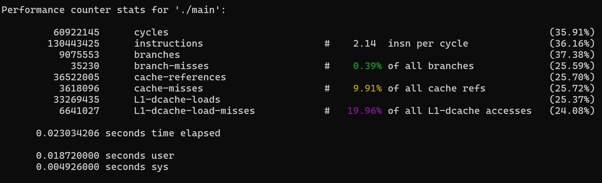

perf stat and timing done with -O2
perf record done with -O0

Running `perf stat`:

- Removed branching in branchy_score - branch misses reduced to 0.85% but no improvement in performance
- Unroll the loop in process_packets and batch the idx loads. By experimentation, unroll factor of 8 is best.
- cold_column_probe iterates over the whole history vector. So instead of two nested loops, just loop over the vector once.
- In refresh_history replace `% history_cols` with `& (history_cols - 1)` as history_cols is always a power of 2 (128 or 2048).
- Remove multiplication for finding row_start in every iteration in refresh_history.
- Unroll loops using STEPS completely as STEPS is a small constant
- Tested using ternary operator in branchy_score, didn't have any improvement in performance.
- Use std::accumulate in cold_column_probe.

Branch misses decreased to 0.1% and cache misses decreased from 40% to 20%.

Hotspots change after changing history_cols to 2048.

Perf record with history_cols = 128

Perf record with history_cols = 2048

Perf stat with -O3:

Before:

After:

## Second try

Above, the performance was not visibly improving as by doing the loop unrollings for chase_dependency, I inadvertently increased the instruction count. So even if cache-misses reduced significantly, the increased instructions compensated.

Now on top of the above refactorings, instead of calling chase_dependency I pre-built the sums starting from each index. This way pointer-chasing is just done once at the beginning instead of in calls to process_packets. Also unrolled the inner loop as STEPS is a small constant.

Remove cold_column_probe, calculate some directly in refresh_history. history does not change in process_packets, so we can directly find the sum during the refresh_history call. Also make rows static.

Tried: Changing packets from an array of structs to a struct of arrays bit didn't get any improvement in performance.

With -O2:

